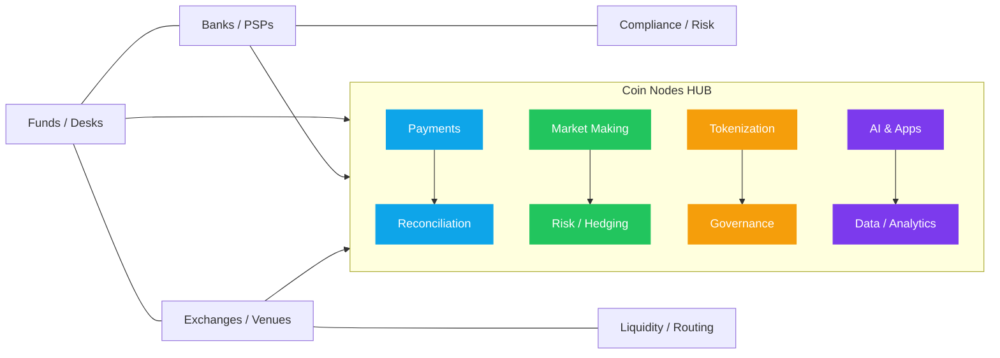

<!-- =====================================================================
README — Coin Nodes LTDA (2025)
Site: https://coinnodes.tech/
===================================================================== -->

<!-- LOGO -->

  

<!-- HERO HEADER -->
<picture>
  <source media="(prefers-color-scheme: dark)" srcset="https://capsule-render.vercel.app/api?type=waving&height=170&color=0:00D4FF,50:7C3AED,100:00D4FF&text=Coin%20Nodes&fontColor=FFFFFF&fontSize=46&animation=fadeIn&section=header&desc=Fintech%20%E2%80%A2%20AI%20%E2%80%A2%20Crypto%20%E2%80%A2%20Payments%20%E2%80%A2%20Market%20Making">
  
</picture>

  
   
  
  
  

---

## 🧭 About

**Coin Nodes** was founded to **maximize returns and mitigate risk** in asset operations — crypto and traditional — through **technology** and **artificial intelligence**.  
We prioritize **security** and **transparency**, offering detailed performance visibility and robust cybersecurity practices.  
Our solutions enable **funds, trading desks, and enterprises** to operate with **high efficiency**, from **payments** to **market making**, with **trust and governance** end-to-end.

---

## 🧩 We are a HUB

We design solutions for an ecosystem connecting **funds**, **banks/PSPs**, **traders**, and **exchanges** — delivering **performance**, **resilience**, and **service excellence** for every stakeholder.

  

---

## 🛠️ Our Services

  

### Technology (Core)
- **Software on-demand for your company** — bespoke digital products, full lifecycle (discovery → delivery → iteration).
- **AI solutions** — automation, anomaly/fraud detection, forecasting, and agentic operations.
- **Web platform, iOS & Android apps** — secure, fast, observable experiences.
- **Experts for banks, lenders, and investment platforms** — integrations, reconciliation, and compliance.

### Financial Operations (HUB)
- 💳 **Crypto ↔ fiat payments** for **funds and operators** (on/off-ramp, reconciliation).
- 🏦 **OTC & Exchange Desk** (FX/BRL, multi-venue, risk policies, routing).
- 🤖 **Market-Maker Bots** (hedge, inventory, TWAP/VWAP, low latency).
- 🧱 **Asset & goods tokenization** (issuance, lifecycle, governance).

> **Stack:** cloud-native (**Kubernetes-first**), IaC with **Terraform**, deep observability, and **SRE mindset**.

---

## 🔐 Security & Reliability

- **Zero-trust** architectures and **least-privilege** by default.  
- **Encryption** in transit and at rest; dedicated key management.  
- **Full-stack observability** (metrics, logs, traces) with actionable runbooks.  
- Rigorous **change management** and systematic **code reviews**.  
- mTLS and secure signing for bank and exchange integrations.

---

## 📞 Contact

  
  
  

---

  © 2025 Coin Nodes LTDA. All rights reserved. 
  The written code and documentation belong to and were built by Coin Nodes LTDA. They are intellectual property and protected by copyright laws. Any unauthorized use, reproduction, or distribution without explicit consent is strictly prohibited.

